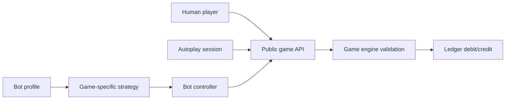
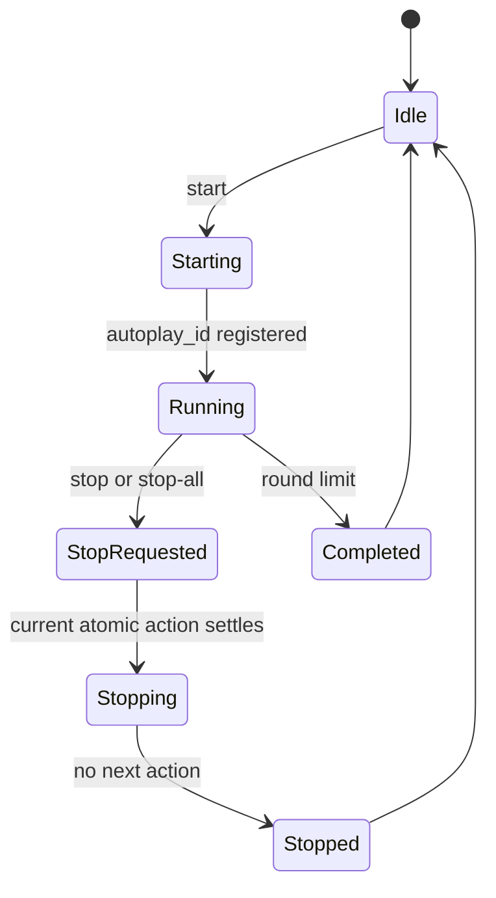
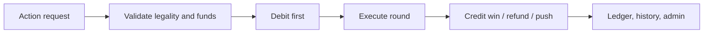

# Virtual Casino Simulator 9.1.0 Requirements and Validation Report

**Release:** Control Plane + UX Stabilization Release  
**Generated:** 2026-07-08T17:33:50Z  
**Document revision:** 9.1.0-docs-redesign

This redesigned documentation uses separated architecture views, cleaner Mermaid diagrams, and a readable full requirement registry. The PDF version uses a landscape layout so diagrams and tables do not collide.

## Executive summary

- Requirements tracked: **344**
- PASS: **344**
- Requirements with API/rule tests: **186**
- Requirements with browser tests: **76**

## Module revisions

| Module | Revision |
|---|---:|
| Core | 9.1.0 |
| Ledger | 9.0.1 |
| Players | 9.0.1 |
| Bot Controller | 1.0.0 |
| Autoplay Controller | 1.1.0 |
| Audio Voice | 9.1.0 |
| Logging | 9.1.0 |
| Roulette | 9.1.0 |
| Slots | 9.0.1 |
| Blackjack | 9.0.1 |
| Baccarat | 9.0.1 |
| Keno | 9.0.1 |
| Bingo | 9.0.1 |
| Admin | 1.1.0 |
| Tests | 1.1.0 |
| Docs | 1.1.0 |

## Architecture diagrams

### Control-plane architecture

```mermaid
flowchart LR
  subgraph U[Player interaction]
    UI[Browser casino UI] --> API[Versioned public APIs] --> ENG[Isolated game engines] --> LED[Ledger / wallet]
  end
  subgraph C[Control plane]
    ADM[/admin console] --> AAPI[Admin APIs] --> CTRL[Control services: bots, autoplay, audio] --> TEL[Telemetry views]
  end
  subgraph P[Evidence and persistence]
    STATE[Player + game state files]
    HIST[History + ledger files]
    LOGS[Logs + requirements + tests]
  end
  ENG --> STATE
  LED --> HIST
  CTRL --> LOGS
  AAPI --> LOGS
```

### Bot separation



### Autoplay state machine



### Money lifecycle



## New or changed v9.1.0 requirements

| ID | Module | Requirement | Status | Tests |
|---|---|---|---|---|
| BOT-001 | Bots | Bots are represented as controllers for player accounts, not embedded game objects. | PASS | API-CONTROL-001 |
| BOT-002 | Bots | Game modules must not import bot strategy modules. | PASS |  |
| BOT-003 | Bots | A bot appears for a game only when it has a compatible strategy. | PASS | API-CONTROL-001 |
| BOT-004 | Bots | Bot actions use the same public game APIs and engine validation paths as human actions. | PASS |  |
| BOT-005 | Bots | Bot money movement uses the shared ledger system. | PASS | API-CONTROL-001 |
| BOT-006 | Bots | Bot strategy assignment is visible and editable from Admin. | PASS |  |
| BOT-007 | Bots | Bot actions are logged with bot_id, player_id, game_id, round context, and strategy_id where applicable. | PASS |  |
| BOT-008 | Bots | Unsupported games hide bot controllers rather than showing incompatible bot settings. | PASS |  |
| AUDIO-001 | Audio | Sound configuration is global and not owned by any game page. | PASS | API-CONTROL-001 |
| AUDIO-002 | Audio | Full Sound and Voice settings live under /admin. | PASS | API-CONTROL-001, BR-AUDIO-001 |
| AUDIO-003 | Audio | Game pages may trigger sound events but do not render full sound settings panels. | PASS |  |
| AUDIO-004 | Audio | Audio settings persist in data/settings/audio.json. | PASS | API-CONTROL-001 |
| AUDIO-005 | Audio | Voice preview uses the currently selected settings. | PASS | BR-AUDIO-001 |
| AUDIO-006 | Audio | Master mute stops new sound effects and voice announcements. | PASS |  |
| AUDIO-007 | Audio | Per-game voice announcements are individually configurable. | PASS |  |
| AUTO-001 | Autoplay | Autoplay is centrally controlled rather than implemented as unrelated game loops. | PASS | API-CONTROL-001 |
| AUTO-002 | Autoplay | Every autoplay run has an autoplay_id. | PASS | API-CONTROL-001 |
| AUTO-003 | Autoplay | Stop prevents any new round or action from starting. | PASS | API-CONTROL-001, BR-AUTO-ROU-001 |
| AUTO-004 | Autoplay | Stop during an atomic action completes that action safely and schedules no follow-up action. | PASS |  |
| AUTO-005 | Autoplay | Autoplay speed consistently affects inter-round delay. | PASS |  |
| AUTO-006 | Autoplay | Autoplay logs start, stop, tick, completion, and error status through the server session store. | PASS |  |
| AUTO-007 | Autoplay | Admin shows active and recent autoplay sessions. | PASS | API-CONTROL-001 |
| AUTO-008 | Autoplay | Admin Stop All requests stop for all server-registered autoplay sessions. | PASS | API-CONTROL-001 |
| AUTO-009 | Autoplay | Roulette autoplay repeats the saved bet template. | PASS | BR-AUTO-ROU-001 |
| AUTO-010 | Autoplay | Slots autoplay repeats current spin parameters. | PASS |  |
| AUTO-011 | Autoplay | Baccarat autoplay repeats selected standing wagers. | PASS |  |
| AUTO-012 | Autoplay | Keno autoplay repeats the selected ticket. | PASS |  |
| AUTO-013 | Autoplay | Bingo autoplay uses stepwise ball calls so Stop is honored between calls. | PASS |  |
| AUTO-014 | Autoplay | Blackjack autoplay remains disabled unless an explicit strategy controller is later enabled. | PASS |  |
| ADMIN-013 | Admin | Admin console uses a dedicated sidebar/topbar control-plane layout. | PASS | API-ADMIN-001, BR-ADMIN-001 |
| ADMIN-014 | Admin | Admin Dashboard shows version, players, bots, autoplay, errors, and requirement summary. | PASS | API-ADMIN-001 |
| ADMIN-015 | Admin | Admin Players & Bots tab shows player balances and bot strategy assignments. | PASS |  |
| ADMIN-016 | Admin | Admin Ledger tab shows transaction audit rows. | PASS | API-ADMIN-001 |
| ADMIN-017 | Admin | Admin Telemetry tab shows app, error, and client logs. | PASS |  |
| ADMIN-018 | Admin | Admin Game States tab shows isolated game state files. | PASS |  |
| ADMIN-019 | Admin | Admin Audio & Voice tab stores global audio settings. | PASS | API-ADMIN-001, BR-ADMIN-001 |
| ADMIN-020 | Admin | Admin Autoplay tab shows sessions and Stop All. | PASS | API-ADMIN-001 |
| ADMIN-021 | Admin | Admin Requirements tab shows requirement coverage. | PASS | API-ADMIN-001 |
| ADMIN-022 | Admin | Admin Tests tab shows latest test results. | PASS | API-ADMIN-001 |
| ROU-051 | Roulette | Roulette wheel must not default to a fake zero result when no spin has occurred. | PASS |  |
| ROU-052 | Roulette | Roulette wheel shows the latest actual spin result after settlement. | PASS | BR-ROU-001 |
| ROU-053 | Roulette | Roulette wheel selected pocket and backend spin result must match. | PASS | BR-ROU-001 |
| ROU-054 | Roulette | Roulette spin animation starts before settlement display and ends on the result state. | PASS |  |
| ROU-055 | Roulette | Roulette ball indicator uses the selected pocket when a result exists. | PASS |  |
| ROU-056 | Roulette | Roulette sound settings are not rendered on the Roulette page. | PASS |  |
| UX-001 | UX | Game stages reserve fixed visual areas during normal gameplay. | PASS | BR-ROU-001 |
| UX-002 | UX | Action rails remain stable while actions execute. | PASS | BR-ROU-001 |
| UX-003 | UX | Result messages render in fixed-height regions. | PASS | BR-ROU-001 |
| UX-004 | UX | Long history, stats, paytables, and logs use internal scroll areas. | PASS |  |
| UX-005 | UX | Autoplay status changes do not resize the main game stage. | PASS |  |
| UX-006 | UX | Animations prefer transform/opacity and avoid layout-changing motion. | PASS |  |
| TEST-025 | Tests | Browser tests use stable data-testid selectors for autoplay and admin controls. | PASS | BR-AUTO-ROU-001, BR-AUDIO-001 |
| TEST-026 | Tests | Browser tests verify Roulette autoplay stop behavior. | PASS | BR-AUTO-ROU-001, BR-AUDIO-001 |
| TEST-027 | Tests | API tests verify bot controller endpoints. | PASS | API-CONTROL-001 |
| TEST-028 | Tests | API tests verify persisted audio settings. | PASS | API-CONTROL-001 |
| TEST-029 | Tests | API tests verify server-registered autoplay session lifecycle. | PASS | API-CONTROL-001 |
| TEST-030 | Tests | Test results remain visible in Admin. | PASS |  |

## Full requirement registry

### Admin

| ID | Requirement | Status | API tests | Browser tests |
|---|---|---|---|---|
| ADMIN-001 | Admin console is available at /admin. | PASS | API-ADMIN-001 | BR-ADMIN-001 |
| ADMIN-002 | Admin console is unauthenticated for local use. | PASS | API-ADMIN-001 |  |
| ADMIN-003 | Admin overview shows version and requirement counts. | PASS | API-ADMIN-001 | BR-ADMIN-001 |
| ADMIN-004 | Admin modules tab shows module revision numbers. | PASS | API-ADMIN-001 |  |
| ADMIN-005 | Admin players tab shows player balances. | PASS | API-ADMIN-001 |  |
| ADMIN-006 | Admin ledger tab shows recent ledger events. | PASS | API-ADMIN-001 |  |
| ADMIN-007 | Admin history tab shows recent history rows. | PASS | API-ADMIN-001 |  |
| ADMIN-008 | Admin logs tab shows app/error/client logs. | PASS | API-ADMIN-001 |  |
| ADMIN-009 | Admin game-states tab shows isolated game states. | PASS | API-ADMIN-001 |  |
| ADMIN-010 | Admin requirements tab shows requirement coverage. | PASS | API-ADMIN-001 |  |
| ADMIN-011 | Admin test-results tab shows latest test results. | PASS | API-ADMIN-001 |  |
| ADMIN-012 | Admin has a return-to-casino control. | PASS |  | BR-ADMIN-001 |
| ADMIN-013 | Admin console uses a dedicated sidebar/topbar control-plane layout. | PASS | API-ADMIN-001 | BR-ADMIN-001 |
| ADMIN-014 | Admin Dashboard shows version, players, bots, autoplay, errors, and requirement summary. | PASS | API-ADMIN-001 |  |
| ADMIN-015 | Admin Players & Bots tab shows player balances and bot strategy assignments. | PASS |  |  |
| ADMIN-016 | Admin Ledger tab shows transaction audit rows. | PASS | API-ADMIN-001 |  |
| ADMIN-017 | Admin Telemetry tab shows app, error, and client logs. | PASS |  |  |
| ADMIN-018 | Admin Game States tab shows isolated game state files. | PASS |  |  |
| ADMIN-019 | Admin Audio & Voice tab stores global audio settings. | PASS | API-ADMIN-001 | BR-ADMIN-001 |
| ADMIN-020 | Admin Autoplay tab shows sessions and Stop All. | PASS | API-ADMIN-001 |  |
| ADMIN-021 | Admin Requirements tab shows requirement coverage. | PASS | API-ADMIN-001 |  |
| ADMIN-022 | Admin Tests tab shows latest test results. | PASS | API-ADMIN-001 |  |

### Audio

| ID | Requirement | Status | API tests | Browser tests |
|---|---|---|---|---|
| AUDIO-001 | Sound configuration is global and not owned by any game page. | PASS | API-CONTROL-001 |  |
| AUDIO-002 | Full Sound and Voice settings live under /admin. | PASS | API-CONTROL-001 | BR-AUDIO-001 |
| AUDIO-003 | Game pages may trigger sound events but do not render full sound settings panels. | PASS |  |  |
| AUDIO-004 | Audio settings persist in data/settings/audio.json. | PASS | API-CONTROL-001 |  |
| AUDIO-005 | Voice preview uses the currently selected settings. | PASS |  | BR-AUDIO-001 |
| AUDIO-006 | Master mute stops new sound effects and voice announcements. | PASS |  |  |
| AUDIO-007 | Per-game voice announcements are individually configurable. | PASS |  |  |

### Autoplay

| ID | Requirement | Status | API tests | Browser tests |
|---|---|---|---|---|
| AUTO-001 | Autoplay is centrally controlled rather than implemented as unrelated game loops. | PASS | API-CONTROL-001 |  |
| AUTO-002 | Every autoplay run has an autoplay_id. | PASS | API-CONTROL-001 |  |
| AUTO-003 | Stop prevents any new round or action from starting. | PASS | API-CONTROL-001 | BR-AUTO-ROU-001 |
| AUTO-004 | Stop during an atomic action completes that action safely and schedules no follow-up action. | PASS |  |  |
| AUTO-005 | Autoplay speed consistently affects inter-round delay. | PASS |  |  |
| AUTO-006 | Autoplay logs start, stop, tick, completion, and error status through the server session store. | PASS |  |  |
| AUTO-007 | Admin shows active and recent autoplay sessions. | PASS | API-CONTROL-001 |  |
| AUTO-008 | Admin Stop All requests stop for all server-registered autoplay sessions. | PASS | API-CONTROL-001 |  |
| AUTO-009 | Roulette autoplay repeats the saved bet template. | PASS |  | BR-AUTO-ROU-001 |
| AUTO-010 | Slots autoplay repeats current spin parameters. | PASS |  |  |
| AUTO-011 | Baccarat autoplay repeats selected standing wagers. | PASS |  |  |
| AUTO-012 | Keno autoplay repeats the selected ticket. | PASS |  |  |
| AUTO-013 | Bingo autoplay uses stepwise ball calls so Stop is honored between calls. | PASS |  |  |
| AUTO-014 | Blackjack autoplay remains disabled unless an explicit strategy controller is later enabled. | PASS |  |  |

### Baccarat

| ID | Requirement | Status | API tests | Browser tests |
|---|---|---|---|---|
| BAC-001 | Baccarat implements Punto Banco Player/Banker/Tie betting. | PASS | API-BAC-001 |  |
| BAC-002 | Baccarat uses configurable 6 or 8 deck shoe. | PASS | API-BAC-001 |  |
| BAC-003 | Baccarat uses persistent shoe state. | PASS | API-BAC-001 |  |
| BAC-004 | Baccarat burn-card procedure runs when shoe is created. | PASS | API-BAC-001 |  |
| BAC-005 | Baccarat cut-card reshuffle threshold is supported. | PASS | API-BAC-001 |  |
| BAC-006 | Baccarat deals in Player, Banker, Player, Banker order. | PASS | API-BAC-001 |  |
| BAC-007 | Aces count as one. | PASS | API-BAC-001 |  |
| BAC-008 | Tens and face cards count as zero. | PASS | API-BAC-001 |  |
| BAC-009 | Hand totals are modulo 10. | PASS | API-BAC-001 |  |
| BAC-010 | Natural 8 or 9 stops drawing. | PASS | API-BAC-001 |  |
| BAC-011 | Player draws on 0-5 and stands on 6-7. | PASS | API-BAC-001 |  |
| BAC-012 | Banker draw tableau is implemented. | PASS | API-BAC-001 |  |
| BAC-013 | Player bet pays 1:1. | PASS | API-BAC-001 |  |
| BAC-014 | Banker bet pays with 5 percent commission by default. | PASS | API-BAC-001 |  |
| BAC-015 | Tie bet pays configurable 8:1 default. | PASS | API-BAC-001 |  |
| BAC-016 | Player/Banker bets push on tie. | PASS | API-BAC-001 |  |
| BAC-017 | Baccarat bets debit immediately. | PASS | API-BAC-001 |  |
| BAC-018 | Baccarat bet cancellation refunds before deal. | PASS | API-BAC-001 |  |
| BAC-019 | Baccarat bots can place strategy bets. | PASS | API-BAC-001 |  |
| BAC-020 | Baccarat UI shows cards, totals, and winner. | PASS |  | BR-BAC-001 |
| BAC-021 | Baccarat UI shows road history. | PASS |  | BR-BAC-001 |
| BAC-022 | Baccarat UI shows shoe and burn info. | PASS |  | BR-BAC-001 |
| BAC-023 | Baccarat auto play repeats selected bet. | PASS |  | BR-BAC-001 |
| BAC-024 | Baccarat writes history rows. | PASS | API-BAC-001 |  |

### Bingo

| ID | Requirement | Status | API tests | Browser tests |
|---|---|---|---|---|
| BINGO-001 | Bingo uses 75-ball American rules. | PASS | API-BINGO-001 |  |
| BINGO-002 | Bingo card has B column 1-15. | PASS | API-BINGO-001 |  |
| BINGO-003 | Bingo card has I column 16-30. | PASS | API-BINGO-001 |  |
| BINGO-004 | Bingo card has N column 31-45. | PASS | API-BINGO-001 |  |
| BINGO-005 | Bingo card has G column 46-60. | PASS | API-BINGO-001 |  |
| BINGO-006 | Bingo card has O column 61-75. | PASS | API-BINGO-001 |  |
| BINGO-007 | Bingo card has free center space. | PASS | API-BINGO-001 |  |
| BINGO-008 | Bingo supports any-line pattern. | PASS | API-BINGO-001 |  |
| BINGO-009 | Bingo supports four-corners pattern. | PASS | API-BINGO-001 |  |
| BINGO-010 | Bingo supports postage-stamp pattern. | PASS | API-BINGO-001 |  |
| BINGO-011 | Bingo supports blackout pattern. | PASS | API-BINGO-001 |  |
| BINGO-012 | Bingo card purchase debits immediately. | PASS | API-BINGO-001 |  |
| BINGO-013 | Bingo reset before called balls refunds cards. | PASS | API-BINGO-001 |  |
| BINGO-014 | Bingo reset after called balls logs abandoned session. | PASS | API-BINGO-001 |  |
| BINGO-015 | Bingo calls unique balls. | PASS | API-BINGO-001 |  |
| BINGO-016 | Bingo called balls use B/I/N/G/O labels. | PASS | API-BINGO-001 |  |
| BINGO-017 | Bingo marks called cells. | PASS |  | BR-BINGO-001 |
| BINGO-018 | Bingo highlights winning pattern. | PASS |  | BR-BINGO-001 |
| BINGO-019 | Bingo supports bot cards. | PASS | API-BINGO-001 |  |
| BINGO-020 | Bingo awards payout to the winning card. | PASS | API-BINGO-001 |  |
| BINGO-021 | Bingo auto play calls until a winner. | PASS | API-BINGO-001 | BR-BINGO-001 |
| BINGO-022 | Bingo UI shows cards in play. | PASS | API-BINGO-001 | BR-BINGO-001 |
| BINGO-023 | Bingo writes history rows. | PASS | API-BINGO-001 |  |
| BINGO-024 | Bingo remains fake-money only. | PASS | API-BINGO-001 |  |

### Blackjack

| ID | Requirement | Status | API tests | Browser tests |
|---|---|---|---|---|
| BJ-001 | Blackjack deals two player cards and two dealer cards. | PASS | API-BJ-001 |  |
| BJ-002 | Dealer hole card is hidden in public state. | PASS |  |  |
| BJ-003 | Aces can count as 1 or 11. | PASS |  |  |
| BJ-004 | Soft totals are computed correctly for multi-ace hands. | PASS |  |  |
| BJ-005 | Natural blackjack pays configured blackjack payout. | PASS |  |  |
| BJ-006 | Push returns the stake. | PASS |  |  |
| BJ-007 | Dealer stands or hits soft 17 according to setting. | PASS |  |  |
| BJ-008 | Player can hit during active hand. | PASS |  |  |
| BJ-009 | Player can stand during active hand. | PASS |  |  |
| BJ-010 | Double down is available when legal. | PASS | API-BJ-001 |  |
| BJ-011 | Double down debits an additional wager. | PASS | API-BJ-001 |  |
| BJ-012 | Double down deals exactly one card and stands. | PASS |  |  |
| BJ-013 | Split is available for equal blackjack values. | PASS | API-BJ-001 |  |
| BJ-014 | Split debits an additional wager. | PASS | API-BJ-001 |  |
| BJ-015 | Resplit is limited by max_split_hands. | PASS |  |  |
| BJ-016 | Double-after-split setting is enforced. | PASS |  |  |
| BJ-017 | Split aces one-card rule is enforced. | PASS |  |  |
| BJ-018 | Late surrender setting is enforced. | PASS |  |  |
| BJ-019 | Surrender credits half the wager. | PASS |  |  |
| BJ-020 | Insurance is available only against dealer Ace. | PASS | API-BJ-001 |  |
| BJ-021 | Insurance cannot be bought more than once. | PASS | API-BJ-001 |  |
| BJ-022 | Insurance maximum is half original wager. | PASS |  |  |
| BJ-023 | Even money is available with player blackjack against dealer Ace. | PASS |  |  |
| BJ-024 | Blackjack table rules cannot change during active rounds. | PASS | API-BJ-001 |  |
| BJ-025 | A player cannot start multiple active blackjack rounds. | PASS | API-BJ-001 |  |
| BJ-026 | Blackjack uses a persistent shoe. | PASS |  |  |
| BJ-027 | Blackjack state endpoint exposes shoe count. | PASS | API-BJ-001 |  |
| BJ-028 | Blackjack UI renders dealer and player hands. | PASS |  | BR-BJ-001 |
| BJ-029 | Blackjack UI exposes action buttons. | PASS |  | BR-BJ-001 |
| BJ-030 | Blackjack writes history rows on settlement. | PASS |  |  |

### Bots

| ID | Requirement | Status | API tests | Browser tests |
|---|---|---|---|---|
| BOT-001 | Bots are represented as controllers for player accounts, not embedded game objects. | PASS | API-CONTROL-001 |  |
| BOT-002 | Game modules must not import bot strategy modules. | PASS |  |  |
| BOT-003 | A bot appears for a game only when it has a compatible strategy. | PASS | API-CONTROL-001 |  |
| BOT-004 | Bot actions use the same public game APIs and engine validation paths as human actions. | PASS |  |  |
| BOT-005 | Bot money movement uses the shared ledger system. | PASS | API-CONTROL-001 |  |
| BOT-006 | Bot strategy assignment is visible and editable from Admin. | PASS |  |  |
| BOT-007 | Bot actions are logged with bot_id, player_id, game_id, round context, and strategy_id where applicable. | PASS |  |  |
| BOT-008 | Unsupported games hide bot controllers rather than showing incompatible bot settings. | PASS |  |  |

### Core

| ID | Requirement | Status | API tests | Browser tests |
|---|---|---|---|---|
| CORE-001 | Application runs locally in a browser from one-click launchers. | PASS |  |  |
| CORE-002 | Windows launcher starts the local Python server. | PASS |  |  |
| CORE-003 | macOS launcher starts the local Python server. | PASS |  |  |
| CORE-004 | Application remains fake-money only with no real payment flows. | PASS |  |  |
| CORE-005 | Lobby loads independently of all individual game modules. | PASS | API-CORE-001 | BR-LOBBY-001 |
| CORE-006 | Top navigation exposes all games equally. | PASS |  | BR-LOBBY-001 |
| CORE-007 | Admin navigation is available without replacing game navigation. | PASS |  |  |
| CORE-008 | Game modules are loaded dynamically on the frontend. | PASS |  |  |
| CORE-009 | Backend game modules are registered through clean API routes. | PASS |  |  |
| CORE-010 | A failure in one frontend game module is contained to that game view when possible. | PASS |  |  |
| CORE-011 | All API responses use a consistent ok/data or ok/error envelope. | PASS | API-CORE-001 |  |
| CORE-012 | The app exposes /api/v1 versioned routes. | PASS | API-CORE-001 |  |
| CORE-013 | The server writes no-store cache headers for API responses. | PASS |  |  |
| CORE-014 | The app supports state reset for testing. | PASS |  |  |
| CORE-015 | The app preserves compact 1080p layout using panel-level scroll areas. | PASS |  | BR-LOBBY-001 |
| CORE-016 | The casino state endpoint returns games, players, recent history, and ledger. | PASS | API-CORE-001 |  |
| CORE-017 | The app stores persistent data under data/. | PASS |  |  |
| CORE-018 | The app stores isolated per-game state under data/games/. | PASS |  |  |
| CORE-019 | The app migrates older v7/v8 data best-effort. | PASS |  |  |
| CORE-020 | The README documents run and test commands. | PASS |  |  |

### Documentation

| ID | Requirement | Status | API tests | Browser tests |
|---|---|---|---|---|
| DOC-001 | A PDF requirements and validation document is generated for the release. | PASS |  |  |
| DOC-002 | Markdown copy of requirements document is included. | PASS |  |  |
| DOC-003 | Requirements are numbered with stable IDs. | PASS | API-ADMIN-001 |  |
| DOC-004 | Each requirement lists module ownership. | PASS | API-ADMIN-001 |  |
| DOC-005 | Each requirement lists implementation files. | PASS |  |  |
| DOC-006 | Each requirement lists validation status. | PASS | API-ADMIN-001 |  |
| DOC-007 | Each requirement lists API tests where applicable. | PASS |  |  |
| DOC-008 | Each requirement lists browser tests where applicable. | PASS |  |  |
| DOC-009 | Module-specific revision numbers are documented. | PASS |  |  |
| DOC-010 | Architecture diagram is included in the PDF. | PASS |  |  |
| DOC-011 | API surface diagram is included in the PDF. | PASS |  |  |
| DOC-012 | Data/logging diagram is included in the PDF. | PASS |  |  |
| DOC-013 | Release notes are included in the package. | PASS |  |  |
| DOC-014 | Release notes summarize fixed regressions. | PASS |  |  |
| DOC-015 | Known limitations are documented when applicable. | PASS |  |  |

### Keno

| ID | Requirement | Status | API tests | Browser tests |
|---|---|---|---|---|
| KENO-001 | Keno supports numbers 1 through 80. | PASS | API-KENO-001 |  |
| KENO-002 | Keno allows selecting 1 to 20 spots. | PASS | API-KENO-001 |  |
| KENO-003 | Keno draws 20 unique numbers. | PASS | API-KENO-001 |  |
| KENO-004 | Keno uses explicit paytable rows for 1-20 spots. | PASS | API-KENO-001 |  |
| KENO-005 | Keno ticket purchase debits immediately. | PASS | API-KENO-001 |  |
| KENO-006 | Keno ticket cancellation refunds before draw. | PASS | API-KENO-001 |  |
| KENO-007 | Keno payout is based on spots, catches, and wager. | PASS | API-KENO-001 |  |
| KENO-008 | Keno stores last draws. | PASS | API-KENO-001 |  |
| KENO-009 | Keno UI has unique test IDs for every number. | PASS |  | BR-KENO-001 |
| KENO-010 | Keno UI highlights selected numbers. | PASS |  | BR-KENO-001 |
| KENO-011 | Keno UI highlights drawn numbers. | PASS |  | BR-KENO-001 |
| KENO-012 | Keno UI highlights catches. | PASS |  | BR-KENO-001 |
| KENO-013 | Keno UI displays paytable. | PASS |  | BR-KENO-001 |
| KENO-014 | Keno UI displays drawn balls. | PASS |  | BR-KENO-001 |
| KENO-015 | Keno draw animation reveals balls. | PASS |  | BR-KENO-001 |
| KENO-016 | Keno bots can buy quick-pick tickets. | PASS | API-KENO-001 | BR-KENO-001 |
| KENO-017 | Keno bot strategies include 3/5/10/20 spot quick picks. | PASS | API-KENO-001 | BR-KENO-001 |
| KENO-018 | Keno auto play repeats selected ticket. | PASS |  | BR-KENO-001 |
| KENO-019 | Keno speed control supports slow/medium/fast. | PASS |  | BR-KENO-001 |
| KENO-020 | Keno writes history rows. | PASS | API-KENO-001 | BR-KENO-001 |
| KENO-021 | Keno remains fake-money only. | PASS |  | BR-KENO-001 |
| KENO-022 | Keno browser tests avoid ambiguous text selectors. | PASS |  | BR-KENO-001 |

### Ledger

| ID | Requirement | Status | API tests | Browser tests |
|---|---|---|---|---|
| LEDGER-001 | Each player has a persistent fake-money balance. | PASS |  |  |
| LEDGER-002 | Human player exists by default. | PASS |  |  |
| LEDGER-003 | Three bot players exist by default. | PASS |  |  |
| LEDGER-004 | Add-money requires a positive amount. | PASS |  |  |
| LEDGER-005 | All betting debits go through the ledger service. | PASS | API-ROU-001 |  |
| LEDGER-006 | All payout credits go through the ledger service. | PASS |  |  |
| LEDGER-007 | Ledger events include player, game, round, transaction type, amount, before, and after balance. | PASS |  |  |
| LEDGER-008 | Ledger is append-only JSONL. | PASS |  |  |
| LEDGER-009 | Insufficient funds rejects debit transactions. | PASS |  |  |
| LEDGER-010 | Roulette bet placement debits immediately. | PASS | API-ROU-001 |  |
| LEDGER-011 | Roulette clear-before-spin credits refunds. | PASS | API-ROU-001 |  |
| LEDGER-012 | Blackjack initial deal debits immediately. | PASS | API-BJ-001 |  |
| LEDGER-013 | Blackjack double down debits separately. | PASS | API-BJ-001 |  |
| LEDGER-014 | Blackjack split debits separately. | PASS | API-BJ-001 |  |
| LEDGER-015 | Blackjack insurance debits separately. | PASS | API-BJ-001 |  |
| LEDGER-016 | Baccarat bet placement debits immediately. | PASS | API-BAC-001 |  |
| LEDGER-017 | Baccarat bet cancellation credits refunds. | PASS | API-BAC-001 |  |
| LEDGER-018 | Keno ticket purchase debits immediately. | PASS | API-KENO-001 |  |
| LEDGER-019 | Keno ticket cancellation credits refunds. | PASS | API-KENO-001 |  |
| LEDGER-020 | Bingo card purchase debits immediately. | PASS | API-BINGO-001 |  |
| LEDGER-021 | Bingo reset before calls credits refunds. | PASS | API-BINGO-001 |  |
| LEDGER-022 | Slot spin debits spin cost before settlement. | PASS | API-SLOT-001 |  |
| LEDGER-023 | All game settlement payouts credit after results are known. | PASS | API-ROU-001 |  |
| LEDGER-024 | Ledger is visible in the admin console. | PASS |  |  |
| LEDGER-025 | Player balances are visible in the main UI. | PASS |  |  |

### Logging

| ID | Requirement | Status | API tests | Browser tests |
|---|---|---|---|---|
| LOG-001 | Application log is written as JSONL. | PASS |  |  |
| LOG-002 | Error log is written as JSONL. | PASS |  |  |
| LOG-003 | Client/browser log is written as JSONL. | PASS |  |  |
| LOG-004 | API requests are logged with method and path. | PASS |  |  |
| LOG-005 | Unhandled API exceptions are logged. | PASS |  |  |
| LOG-006 | Client window errors are posted to the backend logger. | PASS |  |  |
| LOG-007 | Recent app logs are exposed through admin APIs. | PASS | API-ADMIN-001 |  |
| LOG-008 | Recent error logs are exposed through admin APIs. | PASS | API-ADMIN-001 |  |
| LOG-009 | Recent client logs are exposed through admin APIs. | PASS | API-ADMIN-001 |  |
| LOG-010 | Logs are displayed in the /admin console. | PASS | API-ADMIN-001 | BR-ADMIN-001 |
| LOG-011 | Test results are written under logs/test-runs/. | PASS | API-ADMIN-001 |  |
| LOG-012 | Bingo abandoned sessions are logged. | PASS |  |  |
| LOG-013 | Roulette spin results are logged. | PASS |  |  |
| LOG-014 | Blackjack deals are logged. | PASS |  |  |
| LOG-015 | Baccarat coups are logged. | PASS |  |  |

### Roulette

| ID | Requirement | Status | API tests | Browser tests |
|---|---|---|---|---|
| ROU-001 | Single-zero roulette mode supports 0 and 1-36. | PASS | API-ROU-001 |  |
| ROU-002 | Double-zero roulette mode supports 0, 00, and 1-36. | PASS | API-ROU-001 |  |
| ROU-003 | Wheel mode cannot change while open bets exist. | PASS | API-ROU-001 |  |
| ROU-004 | Zero rule selector supports normal, la partage, and en prison. | PASS | API-ROU-001 |  |
| ROU-005 | Straight-up bets are legal for all wheel numbers. | PASS | API-ROU-001 |  |
| ROU-006 | Split bets are legal for adjacent table numbers. | PASS | API-ROU-001 |  |
| ROU-007 | Zero split 0/00 is legal in double-zero mode. | PASS | API-ROU-001 |  |
| ROU-008 | Street bets are legal for each table row. | PASS | API-ROU-001 |  |
| ROU-009 | Corner bets are legal for all four-number intersections. | PASS | API-ROU-001 |  |
| ROU-010 | Six-line bets are legal for adjacent row pairs. | PASS | API-ROU-001 |  |
| ROU-011 | Zero trios are exposed where layout-appropriate. | PASS | API-ROU-001 |  |
| ROU-012 | First-four/top-line bets are exposed by mode. | PASS | API-ROU-001 |  |
| ROU-013 | Dozen bets are exposed and pay 2:1 net. | PASS | API-ROU-001 |  |
| ROU-014 | Column bets are exposed and pay 2:1 net. | PASS | API-ROU-001 |  |
| ROU-015 | Red and black outside bets are exposed. | PASS | API-ROU-001 |  |
| ROU-016 | Odd and even outside bets are exposed. | PASS | API-ROU-001 |  |
| ROU-017 | Low and high outside bets are exposed. | PASS | API-ROU-001 |  |
| ROU-018 | Snake bet is exposed. | PASS | API-ROU-001 |  |
| ROU-019 | Racetrack call bets include Snake. | PASS | API-ROU-001 |  |
| ROU-020 | Racetrack call bets include Voisins. | PASS | API-ROU-001 |  |
| ROU-021 | Racetrack call bets include Tiers. | PASS | API-ROU-001 |  |
| ROU-022 | Racetrack call bets include Orphelins. | PASS | API-ROU-001 |  |
| ROU-023 | Racetrack call bets include Jeu Zero. | PASS | API-ROU-001 |  |
| ROU-024 | Racetrack call bets include number and neighbors. | PASS | API-ROU-001 |  |
| ROU-025 | Racetrack call bets include final digit. | PASS | API-ROU-001 |  |
| ROU-026 | Racetrack call bets include complete number. | PASS | API-ROU-001 |  |
| ROU-027 | Straight-up winning bets credit stake plus 35:1 profit. | PASS | API-ROU-001 |  |
| ROU-028 | Split winning bets credit stake plus 17:1 profit. | PASS | API-ROU-001 |  |
| ROU-029 | Street winning bets credit stake plus 11:1 profit. | PASS | API-ROU-001 |  |
| ROU-030 | Corner winning bets credit stake plus 8:1 profit. | PASS | API-ROU-001 |  |
| ROU-031 | Line winning bets credit stake plus 5:1 profit. | PASS | API-ROU-001 |  |
| ROU-032 | La partage returns half of even-money outside bets on zero. | PASS | API-ROU-001 |  |
| ROU-033 | En prison carries eligible even-money outside bets into the next round. | PASS | API-ROU-001 |  |
| ROU-034 | Roulette spin writes history rows. | PASS | API-ROU-001 |  |
| ROU-035 | Roulette stores last 1000 roll results. | PASS | API-ROU-001 |  |
| ROU-036 | Roulette stats include frequency by number. | PASS | API-ROU-001 |  |
| ROU-037 | Roulette stats include red/black/green counts. | PASS | API-ROU-001 |  |
| ROU-038 | Roulette stats include odd/even counts. | PASS | API-ROU-001 |  |
| ROU-039 | Roulette stats include low/high counts. | PASS | API-ROU-001 |  |
| ROU-040 | Roulette stats include dozen and column counts. | PASS | API-ROU-001 |  |
| ROU-041 | Roulette UI renders a vector wheel. | PASS |  | BR-ROU-001 |
| ROU-042 | Roulette UI animates wheel and ball while spinning. | PASS |  | BR-ROU-001 |
| ROU-043 | Roulette UI renders a real table-style layout. | PASS |  | BR-ROU-001 |
| ROU-044 | Roulette UI allows clicking number cells for straight bets. | PASS |  | BR-ROU-001 |
| ROU-045 | Roulette UI exposes clickable inside-bet spots. | PASS |  | BR-ROU-001 |
| ROU-046 | Roulette UI draws chips on table spots with amounts. | PASS |  | BR-ROU-001 |
| ROU-047 | Roulette auto play repeats saved bet templates. | PASS | API-ROU-001 | BR-ROU-001 |
| ROU-048 | Roulette bots can be enabled with strategy and stake settings. | PASS | API-ROU-001 | BR-ROU-001 |
| ROU-049 | Roulette scoreboard shows human and bot balances. | PASS |  | BR-ROU-001 |
| ROU-050 | Roulette voice announces the rolled number. | PASS |  | BR-ROU-001 |
| ROU-051 | Roulette wheel must not default to a fake zero result when no spin has occurred. | PASS |  |  |
| ROU-052 | Roulette wheel shows the latest actual spin result after settlement. | PASS |  | BR-ROU-001 |
| ROU-053 | Roulette wheel selected pocket and backend spin result must match. | PASS |  | BR-ROU-001 |
| ROU-054 | Roulette spin animation starts before settlement display and ends on the result state. | PASS |  |  |
| ROU-055 | Roulette ball indicator uses the selected pocket when a result exists. | PASS |  |  |
| ROU-056 | Roulette sound settings are not rendered on the Roulette page. | PASS |  |  |

### Slots

| ID | Requirement | Status | API tests | Browser tests |
|---|---|---|---|---|
| SLOT-001 | Slots uses five reels. | PASS | API-SLOT-001 |  |
| SLOT-002 | Slots uses three visible rows. | PASS | API-SLOT-001 |  |
| SLOT-003 | Slots uses reel-strip stop positions. | PASS | API-SLOT-001 |  |
| SLOT-004 | Slots supports 1 payline. | PASS | API-SLOT-001 |  |
| SLOT-005 | Slots supports 3 paylines. | PASS | API-SLOT-001 |  |
| SLOT-006 | Slots supports 5 paylines. | PASS | API-SLOT-001 |  |
| SLOT-007 | Slots supports 9 paylines. | PASS | API-SLOT-001 |  |
| SLOT-008 | Slots supports 20 paylines. | PASS | API-SLOT-001 |  |
| SLOT-009 | Slots evaluates wild substitutions. | PASS | API-SLOT-001 |  |
| SLOT-010 | Slots evaluates scatter payouts. | PASS | API-SLOT-001 |  |
| SLOT-011 | Slots awards free spins on scatter trigger. | PASS | API-SLOT-001 |  |
| SLOT-012 | Slots carries free spins in persistent state. | PASS | API-SLOT-001 |  |
| SLOT-013 | Slots maintains fake progressive jackpot. | PASS | API-SLOT-001 |  |
| SLOT-014 | Slots resets progressive after jackpot hit. | PASS | API-SLOT-001 |  |
| SLOT-015 | Slots exposes paytable in API. | PASS | API-SLOT-001 |  |
| SLOT-016 | Slots displays paytable in UI. | PASS | API-SLOT-001 |  |
| SLOT-017 | Slots debits non-free spin cost immediately. | PASS | API-SLOT-001 |  |
| SLOT-018 | Slots credits wins after spin evaluation. | PASS | API-SLOT-001 |  |
| SLOT-019 | Slots logs spin history. | PASS | API-SLOT-001 |  |
| SLOT-020 | Slots UI animates reels. | PASS |  | BR-SLOT-001 |
| SLOT-021 | Slots UI highlights winning symbols. | PASS |  | BR-SLOT-001 |
| SLOT-022 | Slots UI shows recent spins. | PASS |  | BR-SLOT-001 |
| SLOT-023 | Slots auto play repeats selected line setup. | PASS |  | BR-SLOT-001 |
| SLOT-024 | Slots speed control supports slow/medium/fast. | PASS |  | BR-SLOT-001 |
| SLOT-025 | Slots sounds play during spin. | PASS |  | BR-SLOT-001 |
| SLOT-026 | Slots remains fake-money only. | PASS |  | BR-SLOT-001 |

### Testing

| ID | Requirement | Status | API tests | Browser tests |
|---|---|---|---|---|
| TEST-001 | API test harness starts local server on a free port. | PASS | API-ADMIN-001 |  |
| TEST-002 | API test harness resets state before tests. | PASS | API-ADMIN-001 |  |
| TEST-003 | API tests validate core and admin endpoints. | PASS |  |  |
| TEST-004 | API tests validate roulette debit/settlement/rebet/en-prison. | PASS |  |  |
| TEST-005 | API tests validate slots spin behavior. | PASS |  |  |
| TEST-006 | API tests validate blackjack active-round protections. | PASS |  |  |
| TEST-007 | API tests validate baccarat deal behavior. | PASS |  |  |
| TEST-008 | API tests validate Keno paytable and draw behavior. | PASS |  |  |
| TEST-009 | API tests validate Bingo refund and auto-win behavior. | PASS |  |  |
| TEST-010 | Browser test harness uses Playwright. | PASS |  | BR-ADMIN-001 |
| TEST-011 | Browser tests reset state before tests. | PASS |  | BR-ADMIN-001 |
| TEST-012 | Browser tests use stable data-testid selectors. | PASS |  | BR-ADMIN-001 |
| TEST-013 | Browser tests capture console errors. | PASS |  | BR-ADMIN-001 |
| TEST-014 | Browser tests capture page errors. | PASS |  | BR-ADMIN-001 |
| TEST-015 | Browser tests save screenshots on failure. | PASS |  | BR-ADMIN-001 |
| TEST-016 | Browser tests validate lobby load. | PASS |  | BR-ADMIN-001 |
| TEST-017 | Browser tests validate roulette wheel/table/chips/spin. | PASS |  | BR-ADMIN-001 |
| TEST-018 | Browser tests validate slots spin UI. | PASS |  | BR-ADMIN-001 |
| TEST-019 | Browser tests validate Keno number selectors. | PASS |  | BR-ADMIN-001 |
| TEST-020 | Browser tests validate Bingo card UI. | PASS |  | BR-ADMIN-001 |
| TEST-021 | Browser tests validate Blackjack hand UI. | PASS |  | BR-ADMIN-001 |
| TEST-022 | Browser tests validate Baccarat deal UI. | PASS |  | BR-ADMIN-001 |
| TEST-023 | Browser tests validate Admin UI. | PASS |  | BR-ADMIN-001 |
| TEST-024 | Test results are written to JSON for admin viewing. | PASS | API-ADMIN-001 | BR-ADMIN-001 |

### Tests

| ID | Requirement | Status | API tests | Browser tests |
|---|---|---|---|---|
| TEST-025 | Browser tests use stable data-testid selectors for autoplay and admin controls. | PASS |  | BR-AUTO-ROU-001, BR-AUDIO-001 |
| TEST-026 | Browser tests verify Roulette autoplay stop behavior. | PASS |  | BR-AUTO-ROU-001, BR-AUDIO-001 |
| TEST-027 | API tests verify bot controller endpoints. | PASS | API-CONTROL-001 |  |
| TEST-028 | API tests verify persisted audio settings. | PASS | API-CONTROL-001 |  |
| TEST-029 | API tests verify server-registered autoplay session lifecycle. | PASS | API-CONTROL-001 |  |
| TEST-030 | Test results remain visible in Admin. | PASS |  |  |

### UX

| ID | Requirement | Status | API tests | Browser tests |
|---|---|---|---|---|
| UX-001 | Game stages reserve fixed visual areas during normal gameplay. | PASS |  | BR-ROU-001 |
| UX-002 | Action rails remain stable while actions execute. | PASS |  | BR-ROU-001 |
| UX-003 | Result messages render in fixed-height regions. | PASS |  | BR-ROU-001 |
| UX-004 | Long history, stats, paytables, and logs use internal scroll areas. | PASS |  |  |
| UX-005 | Autoplay status changes do not resize the main game stage. | PASS |  |  |
| UX-006 | Animations prefer transform/opacity and avoid layout-changing motion. | PASS |  |  |
